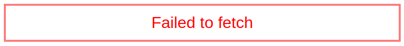
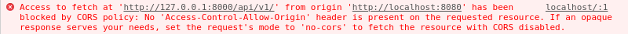

Relaks Django Todo Example
--------------------------

This example demonstrates how to modify a remote database using [Relaks](https://github.com/trambarhq/relaks) and [Relaks Django Data Source](https://github.com/trambarhq/relaks-django-data-source). It makes use of the Django back-end from William S. Vincent's [tutorial on the Django REST framework](https://wsvincent.com/django-rest-framework-authentication-tutorial/). The database consists of a list of todo items. We'll build a simple front-end that lets the user add new items and edit them.

## Getting started

First, set up Django and Django REST, following the detailed instructions at the [Mr. Vincent's post](https://wsvincent.com/django-rest-framework-authentication-tutorial/). Once you have Django up and running, clone this repository then run `npm install`. When that's done, run `npm run dev` to launch [WebPack Dev Server](https://webpack.js.org/configuration/dev-server/). Open a browser window and enter `http://localhost:8080` as the location.

## Tripping an error boundary

The first thing that you'll see is...uh, a big error message:





We've run into a CORS violation. Django is listening at port 8000 while our front-end is served from port 8080. The difference in port number means the server must send HTTP headers specifically granting cross-origin access. We can fix that easily. The little hiccup actually is a useful demonstration of Relaks's ability to work with error boundary.

[Error boundary](https://reactjs.org/docs/error-boundaries.html) is a new feature in React 16. When an error occurs in a component's `render()` method, React can now handle it in a structured manner (instead of just blowing up). Relaks extends that to errors in asynchronous code. As indicated by the console message, the error was caused by the component `TodoList`, when it tries to fetch a list of todos from Django.

## Enabling CORS

To enable CORS, we need to install the middleware [django-cors-headers](https://pypi.org/project/django-cors-headers/). First shutdown Django, then run the following command at the command prompt:

```sh
pipenv install django-cors-headers
```

When that finishes, open `demo_project/settings.py` and add `corsheaders` to `INSTALLED_APPS` and `corsheaders.middleware.CorsMiddleware` to `MIDDLEWARE`:

```python
# demo_project/settings.py

INSTALLED_APPS = [
    'django.contrib.admin',
    'django.contrib.auth',
    'django.contrib.contenttypes',
    'django.contrib.sessions',
    'django.contrib.messages',
    'django.contrib.staticfiles',
    'corsheaders',  # new
    'rest_framework',
    'api',
    'todos',
]

MIDDLEWARE = [
    'django.middleware.security.SecurityMiddleware',
    'django.contrib.sessions.middleware.SessionMiddleware',
    'corsheaders.middleware.CorsMiddleware',  # new
    'django.middleware.common.CommonMiddleware',
    'django.middleware.csrf.CsrfViewMiddleware',
    'django.contrib.auth.middleware.AuthenticationMiddleware',
    'django.contrib.messages.middleware.MessageMiddleware',
    'django.middleware.clickjacking.XFrameOptionsMiddleware',
]
```

Then add the variable `CORS_ORIGIN_ALLOW_ALL` and set it to `True`:

```python
CORS_ORIGIN_ALLOW_ALL = True  # new
```

Restart the server:

```sh
python manage.py runserver
```

Now when you refresh the web page, it should work properly...sort of. As configured, the server does not require authentication to make changes. That's not what we want.

## Enabling access control

To enable access control, we need to install the middleware [django-rest-auth](https://pypi.org/project/django-rest-auth/). Shutdown Django and run the following command:

```sh
pipenv install django-rest-auth
```

Open `demo_project/settings.py` and add `rest_framework.authtoken` and `rest_auth` to `INSTALLED_APPS`:

```python
# demo_project/settings.py

INSTALLED_APPS = [
    'django.contrib.admin',
    'django.contrib.auth',
    'django.contrib.contenttypes',
    'django.contrib.sessions',
    'django.contrib.messages',
    'django.contrib.staticfiles',
    'corsheaders',
    'rest_framework',
    'rest_framework.authtoken',  # new
    'rest_auth',  # new
    'api',
    'todos',
]
```

And change this:

```python
REST_FRAMEWORK = {
    'DEFAULT_PERMISSION_CLASSES': [
        'rest_framework.permissions.AllowAny'
    ],
}
```

to this:

```python
REST_FRAMEWORK = {
    'DEFAULT_AUTHENTICATION_CLASSES': [
       'rest_framework.authentication.TokenAuthentication',
    ],
    'DEFAULT_PERMISSION_CLASSES': [
        'rest_framework.permissions.IsAuthenticated',
    ],
}
```

Open `demo_project/urls.py` and add the endpoint for `rest-auth`:

```python
urlpatterns = [
    path('admin/', admin.site.urls),
    path('api/v1/', include('api.urls')),
    path('api/v1/rest-auth/', include('rest_auth.urls')),   # new
]
```

Start the server again:

```sh
python manage.py runserver
```

Phew! Now that we've got everything up and working, let's take a look at the code.

## Bootstrap code

The bootstrap code ([main.js](https://github.com/trambarhq/relaks-django-todo-example/blob/master/src/main.js)) for this example is fairly simple:

```javascript
import { createElement } from 'react';
import { render } from 'react-dom';
import { DataSource } from 'relaks-django-data-source';
import { FrontEnd } from './front-end.jsx';

window.addEventListener('load', initialize);

function initialize(evt) {
  // create data source
  const dataSource = new DataSource({
    baseURL: 'http://127.0.0.1:8000/api/v1',
    refreshInterval: 5000,
  });
  dataSource.activate();

  const container = document.getElementById('react-container');
  const element = createElement(FrontEnd, { dataSource });
  render(element, container);
}
```

Basically, we create the data source (the Django adapter) and hand it to `FrontEnd`. The refresh interval is set to a rather extreme 5 seconds. This is so that we would quickly see changes made through the Django admin tool. You can try it by logging into the admin tool at `http://127.0.0.1:8000/admin/` and manually adding a todo item. It should appear in the front-end after a few seconds. You can also try running multiple instances of the front-end in different browser windows.

In an real-world app, something like 5 minutes would be more appropriate.

## FrontEnd

`FrontEnd` ([front-end.jsx](https://github.com/trambarhq/relaks-django-todo-example/blob/master/src/front-end.jsx)) is our root React component. It's a functional component that makes use of various [hooks](https://reactjs.org/docs/hooks-intro.html). Its source code is listed below. We'll take a closer look at what each section does further down the page.

```javascript
import React, { useState, useMemo, useEffect } from 'react';
import { useEventTime, useListener } from 'relaks';
import { Django } from './django.js';
import { LoginForm } from './login-form.jsx';
import { LogoutButton } from './logout-button.jsx';
import { TodoList } from './todo-list.jsx';
import { ErrorBoundary } from './error-boundary.jsx';

import './style.scss';

function FrontEnd(props) {
  const { dataSource } = props;
  const [ dataChanged, setDataChanged ] = useEventTime();
  const [ authenticating, setAuthenticating ] = useState(false);
  const django = useMemo(() => {
    return new Django(dataSource);
  }, [ dataSource, dataChanged ])

  const handleAuthentication = useListener(async (evt) => {
    const token = sessionStorage.token;
    const success = await django.authorize(token);
    if (!success) {
      delete sessionStorage.token;
      setAuthenticating(true);
    }
  });
  const handleAuthorization = useListener((evt) => {
    if (authenticating) {
      sessionStorage.token = evt.token;
      setAuthenticating(false);
    }
  });
  const handleDeauthorization = useListener((evt) => {
    delete sessionStorage.token;
  });

  useEffect(() => {
    dataSource.addEventListener('change', setDataChanged);
    dataSource.addEventListener('authentication', handleAuthentication);
    dataSource.addEventListener('authorization', handleAuthorization);
    dataSource.addEventListener('deauthorization', handleDeauthorization);
    return () => {
      dataSource.removeEventListener('change', setDataChanged);
      dataSource.removeEventListener('authentication', handleAuthentication);
      dataSource.removeEventListener('authorization', handleAuthorization);
      dataSource.removeEventListener('deauthorization', handleDeauthorization);
    };
  }, [ dataSource ])

  if (authenticating) {
    return (
      <div>
        <ErrorBoundary>
          <h1>Log in</h1>
          <LoginForm django={django} />
        </ErrorBoundary>
      </div>
    );
  } else {
    return (
      <div>
        <ErrorBoundary>
          <LogoutButton django={django} />
          <h1>To-Do list</h1>
          <TodoList django={django} />
        </ErrorBoundary>
      </div>
    );
  }
}

export {
  FrontEnd
};
```

As in [previous examples](https://github.com/trambarhq/relaks#examples), we're using the `useEventTime` hook to trigger the recreate of our data source's proxy object:

```javascript
  const [ dataChanged, setDataChanged ] = useEventTime();
  const django = useMemo(() => {
    return new Django(dataSource);
  }, [ dataSource, dataChanged ])
```

`setDataChanged` gets attached to `dataSource` alongside other event handlers in a `useEffect` hook:

```javascript
  useEffect(() => {
    dataSource.addEventListener('change', setDataChanged);
    dataSource.addEventListener('authentication', handleAuthentication);
    dataSource.addEventListener('authorization', handleAuthorization);
    dataSource.addEventListener('deauthorization', handleDeauthorization);
    return () => {
      dataSource.removeEventListener('change', setDataChanged);
      dataSource.removeEventListener('authentication', handleAuthentication);
      dataSource.removeEventListener('authorization', handleAuthorization);
      dataSource.removeEventListener('deauthorization', handleDeauthorization);
    };
  }, [ dataSource ])
```

The data source emits an `authentication` event when the remote server responds with the [HTTP status code 401](https://httpstatuses.com/401). We handle the event by providing an authorization token that has been saved earlier into `sessionStorage`. If there isn't one or the token has expired, we set the state variable `authenticating` to `true`. `FrontEnd` will then rerender, showing the login form.

```javascript
  const handleAuthentication = useListener(async (evt) => {
    const token = sessionStorage.token;
    const success = await django.authorize(token);
    if (!success) {
      delete sessionStorage.token;
      setAuthenticating(true);
    }
  });
```

The data source emits an `authorization` event when it receives an authorization token. We save the authorization token to `sessionStorage` and stop showing the login form.

```javascript
  const handleAuthorization = useListener((evt) => {
    if (authenticating) {
      sessionStorage.token = evt.token;
      setAuthenticating(false);
    }
  });
```

The `deauthorization` event occurs when the user logs out. That's time to get rid of the saved token.

```javascript
  const handleDeauthorization = useListener((evt) => {
    delete sessionStorage.token;
  });
```

At the end of the function we return either `LoginForm` or `TodoList` depending on whether we're in the middle of authentication:

```javascript
  if (authenticating) {
    return (
      <div>
        <ErrorBoundary>
          <h1>Log in</h1>
          <LoginForm django={django} />
        </ErrorBoundary>
      </div>
    );
  } else {
    return (
      <div>
        <ErrorBoundary>
          <LogoutButton django={django} />
          <h1>To-Do list</h1>
          <TodoList django={django} />
        </ErrorBoundary>
      </div>
    );
  }
```

Note how each UI component receives `django` as a prop.

We're placing `ErrorBoundary` around our UI components so that any error encountered during rendering would appear on screen. That's what we saw earlier.

## Data source proxy

`Django` ([django.js](https://github.com/trambarhq/relaks-django-todo-example/blob/master/src/django.js)) is a wrapper class. It does little aside from calling corresponding methods in the data source:

```javascript
const loginURL = '/rest-auth/login/';
const logoutURL = '/rest-auth/logout/';

class Django {
  constructor(dataSource) {
    this.dataSource = dataSource;
  }

  async fetchList(url, options) {
    return this.dataSource.fetchList(url, options);
  }

  async saveOne(url, object) {
    if (object.id) {
      return this.dataSource.updateOne(url, object);
    } else {
      return this.dataSource.insertOne(url, object);
    }
  }

  async deleteOne(url, object) {
    return this.dataSource.deleteOne(url, object);
  }

  async logIn(credentials) {
    return this.dataSource.authenticate(loginURL, credentials);
  }

  async logOut() {
    return this.dataSource.revokeAuthorization(logoutURL);
  }

  loggedIn() {
    return this.dataSource.isAuthorized();
  }

  async authorize(token) {
    return this.dataSource.authorize(token);
  }
}

export {
  Django,
};
```

## LoginForm

`LoginForm` ([login-form.jsx](https://github.com/trambarhq/relaks-django-todo-example/blob/master/src/login-form.jsx)) renders a couple text fields and a button. Its source code is fairly straight forward:

```javascript
import React, { useState } from 'react';
import { useListener } from 'relaks';

function LoginForm(props) {
  const { django } = props;
  const [ usename, setUsername ] = useState('');
  const [ password, setPassword ] = useState('');
  const [ error, setError ] = useState();
  const disabled = !username.trim() || !password.trim();

  const handleUsernameChange = useListener((evt) => {
    setUsername(evt.target.value);
  });
  const handlePasswordChange = useListener((evt) => {
    setPassword(evt.target.value);
  });
  const handleFormSubmit = useListener(async (evt) => {
    evt.preventDefault();
    try {
      let credentials = { username, password };
      if (username.indexOf('@') !== -1) {
        credentials = { email: username, password };
      }
      await django.logIn(credentials);
    } catch (err) {
      setError(err);
    }
  });

  return (
    <div className="login-form">
      {renderError()}
      <form onSubmit={handleFormSubmit}>
        <div className="label">Username or E-mail:</div>
        <div className="field">
          <input type="text" value={username} onChange={handleUsernameChange} />
        </div>
        <div className="label">Password:</div>
        <div className="field">
          <input type="password" value={password} onChange={handlePasswordChange} />
        </div>
        <div className="buttons">
          <button type="submit" disabled={disabled}>
            Log in
          </button>
        </div>
      </form>
    </div>
  );

  function renderError() {
    if (!error) {
      return null;
    }
    return <div className="error">Error: {error.message}</div>
  }
}

export {
  LoginForm,
};
```

The event handlers given to the input fields save text into the form's state:

```javascript
  const handleUsernameChange = useListener((evt) => {
    setUsername(evt.target.value);
  });
  const handlePasswordChange = useListener((evt) => {
    setPassword(evt.target.value);
  });
```

When the user clicks the button, the form element fires a `submit` event. We try to log into the system by calling `django.logIn()` with the user-provided credentials:

```javascript
const handleFormSubmit = useListener(async (evt) => {
  evt.preventDefault();
  try {
    let credentials = { username, password };
    if (username.indexOf('@') !== -1) {
      credentials = { email: username, password };
    }
    await django.logIn(credentials);
  } catch (err) {
    setError(err);
  }
});
```

If authentication succeeds, the data source will emit an `authorization` event, `FrontEnd` will rerender and `LoginForm` will be unmounted--we're done here. If it doesn't, we save the error object to the form's state so it can be shown to the user.

## LogoutButton

`LogoutButton` ([logout-button.jsx](https://github.com/trambarhq/relaks-django-todo-example/blob/master/src/logout-button.jsx)) is very simple. It renders a button when the user is logged in and nothing when he's not:

```javascript
import React from 'react';
import { useListener } from 'relaks';

function LogoutButton(props) {
  const { django } = props;

  const handleClick = useListener(async (evt) => {
    await django.logOut();
  });

  if (!django.loggedIn()) {
    return null;
  }
  return (
    <button className="logout" onClick={handleClick}>
      Log out
    </button>
  );
}

export {
  LogoutButton,
};
```

When the user clicks the button, we call `django.logOut()` to log him out of the system.

## TodoList

`TodoList` ([todo-list.jsx](https://github.com/trambarhq/relaks-django-todo-example/blob/master/src/todo-list.jsx)) is a Relaks component. It uses the `useProgress` hook to render itself:

```javascript
import React from 'react';
import Relaks, { useProgress } from 'relaks';
import { TodoView } from 'todo-view';

async function TodoList(props) {
  const { django } = props;
  const [ show ] = useProgress();

  render();
  const options = {
    afterInsert: 'push',
    afterUpdate: 'replace',
    afterDelete: 'remove',
  };
  const todos = await django.fetchList('/', options);
  render();

  function render() {
    if (!todos) {
      show(<div>Loading...</div>);
    } else {
      show(
        <ul className="todo-list">
          {todos.map(renderTodo)}
          <TodoView key={0} django={django} />
        </ul>
      );
    }
  }

  function renderTodo(todo) {
    return <TodoView key={todo.id} django={django} todo={todo} />;
  }
}

const component = Relaks.memo(TodoList);

export {
  component as TodoList,
};
```

The following is the core logic of the component:

```javascript
  render();
  const options = {
    afterInsert: 'push',
    afterUpdate: 'replace',
    afterDelete: 'remove',
  };
  const todos = await django.fetchList('/', options);
  render();
```

Render without data. Fetch data. Render with data. It's pretty simple.

The options given to `fetchList()` are [hooks](https://github.com/trambarhq/relaks-django-data-source#hooks) that update cached results after a write operation. When an object is inserted into a table, by default the data source would choose to rerun a query because it does not know whether the new object meets the query's criteria. Here, we're fetching all objects in the order they were created. We know a newly created object has to show up at the end of the list. We can therefore save a trip to the server by telling the data source to simply push the object into the array. An update to an object can likewise be handled by replacing the old one.

`render()` uses `show()` from the `useProgress` hook to render the component's UI. This helper function in turn calls another helper function:

```javascript
  function render() {
    if (!todos) {
      show(<div>Loading...</div>);
    } else {
      show(
        <ul className="todo-list">
          {todos.map(renderTodo)}
          <TodoView key={0} django={django} />
        </ul>
      );
    }
  }

  function renderTodo(todo) {
    return <TodoView key={todo.id} django={django} todo={todo} />;
  }
```

An extra item is rendered at the end for adding new todo. It has a key of 0 and its `todo` prop will be `undefined`.

## TodoView

`TodoView` ([todo-view.jsx](https://github.com/trambarhq/relaks-django-todo-example/blob/master/src/todo-view.jsx)) is a regular React component. It has three different appearances: (1) when it permits editing; (2) when it's showing a todo; (3) when it's just a button for adding a new todo. There's a lot going on so the code is somewhat longish. Just quickly skim through it. Explanation of each section will follow.

```javascript
import _ from 'lodash';
import React, { useState, useRef } from 'react';
import { useListener, useSaveBuffer, useStickySelection } from 'relaks';
import { mergeObjects } from './merge-utils.js';
import { preserveObject, restoreObject } from './storage-utils.js';

function TodoView(props) {
  const { django, todo } = props;
  const draft = useSaveBuffer({
    original: _.defaults(todo, { title: '', description: '' }),
    compare: _.isEqual,
    merge: mergeObjects,
    preserve: (base, ours) => {
      preserveObject('todo', ours);
    },
    restore: (base) => {
      return restoreObject('todo', base);
    },
  });
  const [ editing, setEditing ] = useState(draft.changed);
  const [ expanded, setExpanded ] = useState(draft.changed);

  const titleRef = useRef();
  const descriptionRef = useRef();
  useStickySelection([ titleRef, descriptionRef ]);

  const handleTitleClick = useListener((evt) => {
    setExpanded(!expanded);
  });
  const handleEditClick = useListener((evt) => {
    setEditing(true);
  });
  const handleDeleteClick = useListener(async (evt) => {
    await django.deleteOne('/', todo);
  });
  const handleSaveClick = useListener(async (evt) => {
    await django.saveOne('/', draft.current);
    setEditing(false);
    draft.reset();
  });
  const handleCancelClick = useListener((evt) => {
    setEditing(false);
    draft.reset();
  });
  const handleTitleChange = useListener((evt) => {
    draft.assign({ title: evt.target.value });
  });
  const handleDescriptionChange = useListener((evt) => {
    draft.assign({ description: evt.target.value });
  });

  if (editing) {
    return renderEditor();
  } else if (todo) {
    return renderView();
  } else {
    return renderAddButton();
  }

  function renderView() {
    const { title, description } = todo;
    const classNames = [ 'todo-view' ];
    if (expanded) {
      classNames.push('expanded');
    }
    return (
      <li className={classNames.join(' ')}>
        <div className="title">
          <span onClick={handleTitleClick}>{title}</span>
        </div>
        <div className="extra">
          <div className="description">{description}</div>
          <div className="buttons">
            <button onClick={handleEditClick}>Edit</button>
            <button onClick={handleDeleteClick}>Delete</button>
          </div>
        </div>
      </li>
    );
  }

  function renderEditor() {
    const { title, description } = draft.current;
    const empty = !_.trim(title) || !_.trim(description);
    const disabled = !draft.changed || empty;
    return (
      <li className="todo-view expanded edit">
        <div className="title">
          <input ref={titleRef} type="text" value={title} onChange={handleTitleChange} />
        </div>
        <div className="extra">
          <div className="description">
            <textarea ref={descriptionRef} value={description} onChange={handleDescriptionChange} />
          </div>
          <div className="buttons">
            <button onClick={handleSaveClick} disabled={disabled}>Save</button>
            <button onClick={handleCancelClick}>Cancel</button>
          </div>
        </div>
      </li>
    );
  }

  function renderAddButton() {
    return (
      <li className="todo-view add">
        <span className="add-button" onClick={handleEditClick}>
          Add new item
        </span>
      </li>
    );
  }
}

export {
  TodoView,
};
```

The function first obtains a **save buffer** from `useSaveBuffer`, a utility hook provided by Relaks. The buffer is used to hold local changes before they're sent to the server.

```javascript
  const draft = useSaveBuffer({
    original: _.defaults(todo, { title: '', description: '' }),
    compare: _.isEqual,
    merge: mergeObjects,
    preserve: (base, ours) => {
      preserveObject('draft', ours);
    },
    restore: (base) => {
      return restoreObject('draft', base);
    },
  });
```

`useSaveBuffer` accepts an object as its only parameter. `original` holds a copy of the object from the remote server. Here we're using lodash's `defaults()` to ensure it has the expected properties. Recall that `todo` can be `undefined`.

`compare` is a function for checking if two values are the same. The default implementation performs an exactly comparison (===), which doesn't work for objects. So we have to supply lodash's `isEqual()`.

`merge` is a function used to merge in new changes from the remote server. It's invoked  the object given as `original` is different from the one in the prior call to `useSaveBuffer` and there're unsaved local changes. The function accepts three parameters: `base`, `ours`, and `theirs`. `base` is the previous object from the server. `ours` is the object with local changes. `theirs` is the new object from the server. These allows us to do a [three-way merge](http://www.drdobbs.com/tools/three-way-merging-a-look-under-the-hood/240164902) incorporating the local changes into the new object. The default implementation simply returns `theirs`, meaning the user would lose his changes.

The implementation provided in this example is fairly sophisticated. It allows multiple users to edit different sections of the same text. You can see the code [here](https://github.com/trambarhq/relaks-django-todo-example/blob/master/src/merge-utils.js).

`preserve` is a function for saving changes temporarily in local storage, in case the user accidentally hits the reload button (or the browser crashes). Its use isn't required but it's a nice feature to have.

`restore` is a function that loads the temporarily saved object.

You can see the code for `preserveObject()` and `restoreObject()` [here](https://github.com/trambarhq/relaks-django-todo-example/blob/master/src/storage-utils.js).

`draft.current` holds the save buffer's current value. Initially, it's going to be the same as `original` and `draft.changed` will be false. Values from `draft.current` are used to populate our input fields:

```javascript
  function renderEditor() {
    const { title, description } = draft.current;
    const empty = !_.trim(title) || !_.trim(description);
    const disabled = !draft.changed || empty;
    return (
      <li className="todo-view expanded edit">
        <div className="title">
          <input ref={titleRef} type="text" value={title} onChange={handleTitleChange} />
        </div>
        <div className="extra">
          <div className="description">
            <textarea ref={descriptionRef} value={description} onChange={handleDescriptionChange} />
          </div>
          <div className="buttons">
            <button onClick={handleSaveClick} disabled={disabled}>Save</button>
            <button onClick={handleCancelClick}>Cancel</button>
          </div>
        </div>
      </li>
    );
  }
```

When the user makes changes through the input fields, `draft.assign()` is called to modify the object:

```javascript
  const handleTitleChange = useListener((evt) => {
    draft.assign({ title: evt.target.value });
  });
  const handleDescriptionChange = useListener((evt) => {
    draft.assign({ description: evt.target.value });
  });
```

When the user clicks the Save button, we call `django.saveOne()` to save changes held in the save buffer:

```javascript
  const handleSaveClick = useListener(async (evt) => {
    await django.saveOne('/', draft.current);
    setEditing(false);
    draft.reset();
  });
```

After the object is saved, we call `setEditing()` to exit edit mode and `draft.reset()` to reset the buffer to the initial state. This is done so that the instance of `TodoView` with key = 0 won't retain the title and description after a new todo is added.

When the user clicks the Cancel button, the same method is called:

```javascript
  const handleCancelClick = useListener((evt) => {
    setEditing(false);
    draft.reset();
  });
```

We use the utility hook `useStickySelection` (provided by Relaks) to maintain the cursor position when new data arrives from the remote server. Without it, concurrent editing would get incredibly annoying as the cursor would continually jump to the end.

```javascript
  const titleRef = useRef();
  const descriptionRef = useRef();
  useStickySelection([ titleRef, descriptionRef ]);
```

The hook accepts an array of refs from `useRef`.

Two state variables, `editing` and `expanded`, are used to track the whether we're editing the todo and whether the view has been expanded:

```javascript
  const [ editing, setEditing ] = useState(draft.changed);
  const [ expanded, setExpanded ] = useState(draft.changed);
```

Their initial values are `draft.changed`. Usually it'll be `false`. If unsaved changes were saved to local storage, however, `draft.changed` will be `true` from the very beginning. The component would then start out in edit mode.

In read-only mode (`editing = false`), only the title of the todo is shown initially. The description, along with a couple buttons, are rendered into a div that's clipped off using CSS. These are shown when the user expands the item by clicking on the title.

```javascript
  function renderView() {
    const { title, description } = todo;
    const className = 'todo-view';
    if (expanded) {
      className += ' expanded';
    }
    return (
      <li className={className}>
        <div className="title">
          <span onClick={handleTitleClick}>{title}</span>
        </div>
        <div className="extra">
          <div className="description">{description}</div>
          <div className="buttons">
            <button onClick={handleEditClick}>Edit</button>
            <button onClick={handleDeleteClick}>Delete</button>
          </div>
        </div>
      </li>
    );
  }
```

The click handler toggles `expanded`:

```javascript
  const handleTitleClick = useListener((evt) => {
    setExpanded(!expanded);
  });
```

When the user clicks the edit button, we enter edit mode:

```javascript
  const handleEditClick = useListener((evt) => {
    setEditing(true);
  });
```

If the user clicks the delete button, we call `django.deleteOne` to delete the object:

```javascript
  const handleDeleteClick = useListener(async (evt) => {
    await django.deleteOne('/', todo);
  });
```

## Update cycle

Let us examine step-by-step the creation process of a todo so you have clearer understanding of what actually happens.

1. `djanog.saveOne()` is called with the new todo.
2. The object is sent to the server using the HTTP POST method.
3. The server responds with a copy of the object, which now has a database id.
4. The data source runs the `afterInsert` hooks of all impacted queries.
5. The `push` handler places the new object at the end our `fetchList()` query's cached results.
6. The data source emits a `change` event.
7. `useMemo()` in `FrontEnd` creates a new `Django` object.
8. `TodoList` is called, which in turns calls `fetchList()`.
9. `fetchList()` immediately returns the modified cached results.
10. `TodoList` rerenders the list of todos, which contains the one that was added.

If we hadn't specified `push` as the `afterInsert` hook, the sequence of event would be different starting at step 5:

5. The default `refresh` handler marks the `fetchList()` query as out-of-date.
6. The data source emits a `change` event.
7. `useMemo()` in `FrontEnd` creates a new `Django` object.
8. `TodoList` is called, which in turns calls `fetchList()`.
9. `fetchList()` immediately returns the old cached results and sends a request to the server.
10. `TodoList` rerenders the old list of todos.
11. The data source receives the query's results after some time. It notices that the list is different and emits a `change` event.
12. `useMemo()` in `FrontEnd` creates a new `Django` object again.
13. `TodoList` is called, which in turns calls `fetchList()`.
14. `fetchList()` immediately returns the new results.
15. `TodoList` rerenders the list of todos, which contains the one that was added.

The default behavior still yields the correct end result, but will seem less smooth as the new object would not appear until the full list is fetched once again.

## Final words

That's it! I hope you were able to follow the example without difficulty.
